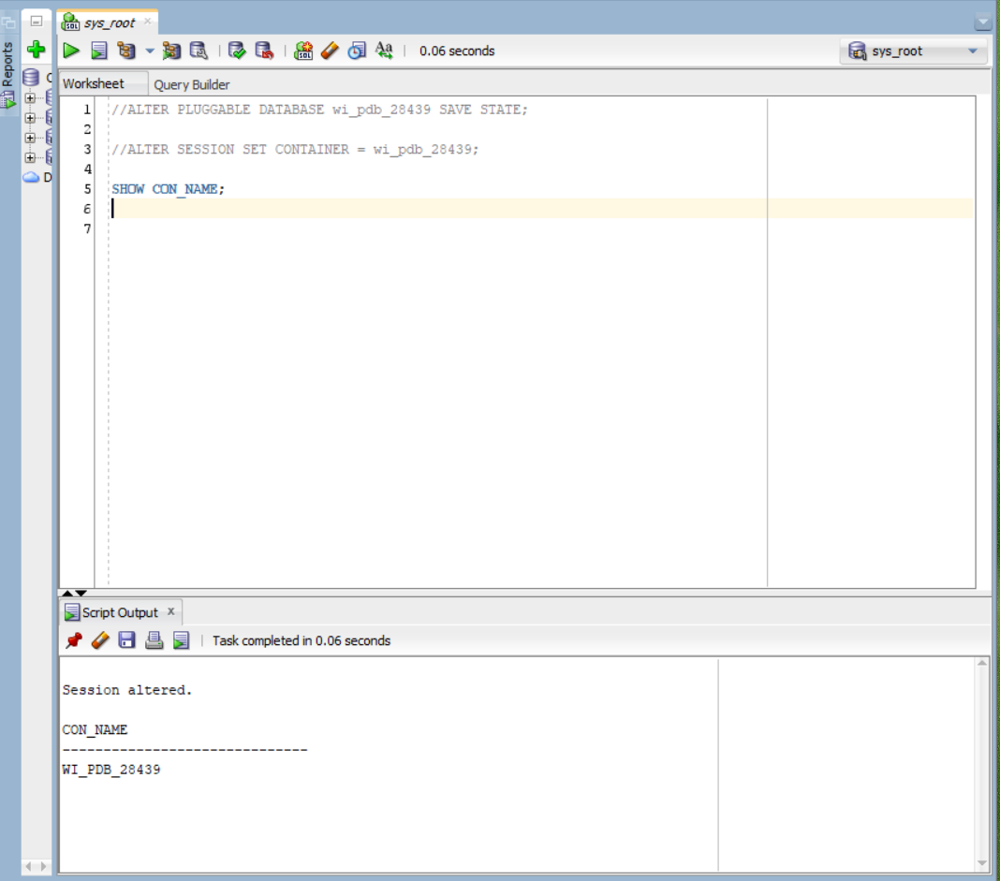
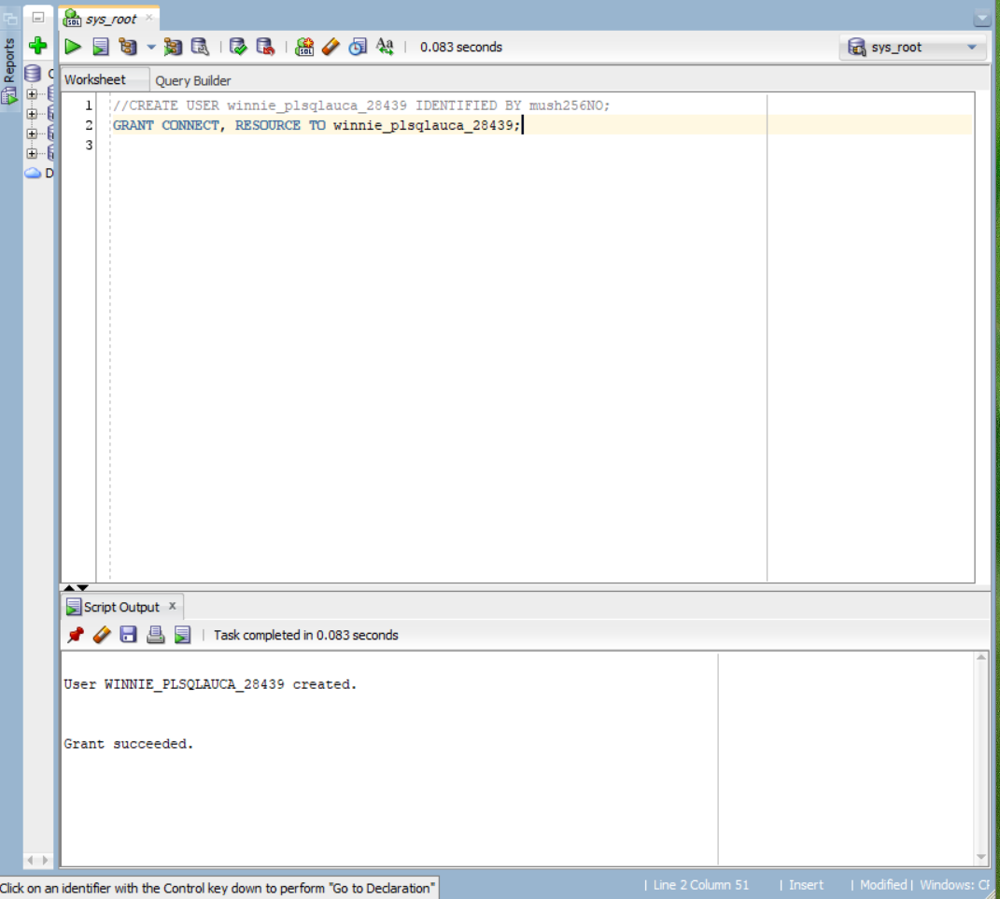
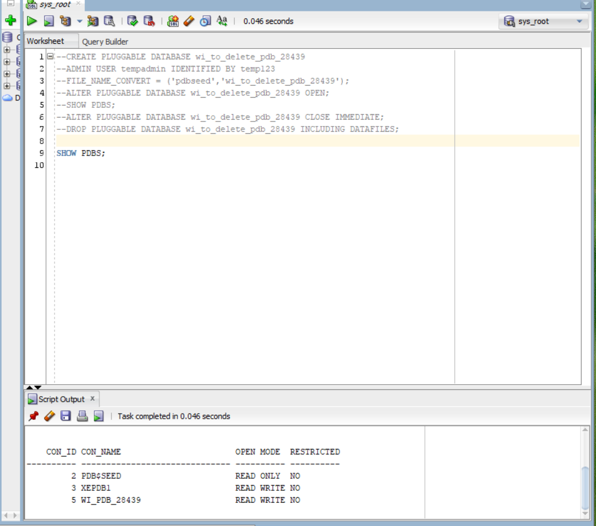

# oracle_pdb_ass_II_28439_Winnie

# Oracle Pluggable Database Assignment II

## Student Information
- Name: FEEZA WINNIE 
- Student ID: 28439
- Course: INSY 8311 - Database Development with PL/SQL
- Instructor: Eric Maniraguha
- Submission Date: Feb-16-26


## Overview
This assignment demonstrates proficiency in Oracle 21c Multi-tenant Architecture by:

Creating a permanent Pluggable Database (PDB) for coursework
Demonstrating PDB lifecycle management through creation and deletion
Configuring and accessing Oracle Enterprise Manager (OEM)


## Oracle Environment
- Oracle Version: Oracle 21c 
- OS: Windows Server
- Tool: SQL*Plus, Oracle Enterprise Manager (OEM)

## Repository content

FEEZA_WINNIE_pdb_28439/
├── README.md  
└── screenshots/  
    ├── 01_CON_NAME.png  
    ├── 02_dashboard.png  
    ├── 03_db_table.png  
    ├── 04_delete_db.png  
    ├── 05_drop_dbs.png  
    ├── 06_grant_user.png  
    ├── 07_PDBS_WI.png  
    ├── 08_pluggable_db.png  
    └── 09_Tablespace.png  


## Task 1: Create a New PDB
## Objective
Create a permanent pluggable database for storing coursework.

PDB Details:

PDB Name: WI_PDB_28439
Admin User: Winnie_plsqlauca_28439
Status: READ WRITE (Auto-open enabled)

### PDB Created






## Task 2: PDB Lifecycle Management
Objective
Demonstrate PDB creation and deletion process.

  permanently deleted and verified
 

  temporarily deleted
 

 ## TASK 3:  Oracle Enterprise Manager

## Objective
Configure and access OEM for database management.

Configuration:

HTTPs Port: 5500

Access URL: https://localhost:5500/em

   dashboard with username visibility

   tablespace view


 ## Challenges and Solutions
Challenge: Got ORA-65019 error a few times
Solution: Realized I was trying to open a PDB that was already open. I started checking status with SHOW PDBS first.


-- Check PDB exists
SHOW PDBS;

-- Verify user created
```sql
ALTER SESSION SET CONTAINER = WI_PDB_28439;
SELECT username FROM dba_users WHERE username LIKE '%PLSQLAUCA%';
```
### Lessons Learned
I learned to always check PDB status before opening to avoid errors. The FILE_NAME_CONVERT parameter is required when creating from pdbseed. Using SAVE STATE means the PDB will open automatically after database restarts. OEM setup was easier than expected once I got the ports configured.

## References
Oracle Database 21c Documentation
Course Lecture: "Introduction to PL/SQL"
Course Lecture: "Oracle Database Environment (CDBs & PDBs) & OEM"
